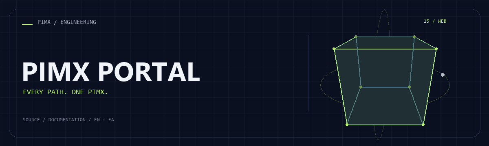

<div align="center">



**[English](README.md) · [فارسی](README.fa.md)**

</div>

<div dir="rtl">

# 🌀 PIMX PORTAL

فهرست تصویری دوزبانه مجموعه PIMX؛ پوسترهای اختصاصی، بازدیدکننده را به ابزارها و بخش حمایت هدایت می‌کنند.

[GitHub](https://github.com/MOHAMMADREZAABEDINPOOR/PIMX_PORTAL) · [PIMX / Profile](https://github.com/MOHAMMADREZAABEDINPOOR) · [بنر ثابت](assets/readme/hero.png)

| نمای کلی | جزئیات |
|:---|:---|
| 🌀 تجربه | برنامه وب / تجربه مرورگری |
| 🧰 فناوری | `React` · `Vite` · `TypeScript` · `Express` |
| 🌐 زبان راهنما | [English](README.md) · [فارسی](README.fa.md) |

[✨ امکانات](#امکانات) · [🚀 شروع کار](#شروع-کار) · [⚙️ تنظیمات](#تنظیمات) · [🌍 استقرار](#استقرار)

---

<a id="امکانات"></a>

## ✨ امکانات

| بخش | قابلیت موجود |
|:---|:---|
| ⚡ روند کار | پوستر مستقل و لینک مستقیم هر پروژه |
| 🌐 تجربه کاربری | متن فارسی و انگلیسی و چیدمان راست و چپ |
| ⚡ روند کار | کامپوننت React با حرکت و طراحی واکنش‌گرا |
| 🔌 اتصال | سرور اختیاری Express برای نسخه ساخته‌شده |

<a id="پشته-فنی"></a>

## 🧰 پشته فنی

| ابزار | نسخه یا منبع |
|---|---|
| React | `^19.2.1` |
| Vite | `^7.1.7` |
| TypeScript | `5.6.3` |
| Express | `^4.21.2` |
| Framer Motion | `^12.23.22` |
| Tailwind CSS | `^4.1.14` |

<a id="شروع-کار"></a>

## 🚀 شروع کار

Node.js 22.12 یا بالاتر و مدیر پکیج مشخص‌شده در package.json. نسخه وابستگی‌ها را مطابق فایل قفل نصب کنید.

<div dir="ltr">

```bash
git clone https://github.com/MOHAMMADREZAABEDINPOOR/PIMX_PORTAL.git
cd PIMX_PORTAL

pnpm install --frozen-lockfile
pnpm run dev
```

</div>

<a id="تنظیمات"></a>

## ⚙️ تنظیمات

کلیدهای زیر از فایل نمونه یا کد استخراج شده‌اند؛ همه الزاماً اجباری نیستند. مقدار و پیش‌فرض را در همان فایل بررسی و اسرار را فقط در محیط محلی یا هاست تنظیم کنید.

| نام | کاربرد |
|---|---|
| `BUILT_IN_FORGE_API_KEY` | اعتبارنامه یا اتصال؛ خصوصی نگه دارید |
| `BUILT_IN_FORGE_API_URL` | تنظیم برنامه؛ تعریف را در منبع بررسی کنید |
| `PORT` | تنظیم برنامه؛ تعریف را در منبع بررسی کنید |

<a id="استفاده"></a>

## 🎯 استفاده

فهرست پروژه‌ها را باز و پوستر موردنظر را انتخاب کنید. برای تغییر مقصد، آرایه projects در client/src/pages/Home.tsx را ویرایش کنید.

<a id="ساختار-پروژه"></a>

## 🗂️ ساختار پروژه

| مسیر | نقش |
|---|---|
| [`assets/`](assets/) | فایل برند، رسانه و README |
| [`client/`](client/) | برنامه مرورگر |
| [`server/`](server/) | پیاده‌سازی سرور |
| [`components.json`](components.json) | فایل ورودی یا تنظیم پروژه |
| [`package.json`](package.json) | فایل ورودی یا تنظیم پروژه |
| [`tsconfig.json`](tsconfig.json) | فایل ورودی یا تنظیم پروژه |
| [`tsconfig.node.json`](tsconfig.node.json) | فایل ورودی یا تنظیم پروژه |

<a id="فرمان‌ها-و-بررسی"></a>

## 🧪 فرمان‌ها و بررسی

| فرمان | کاربرد |
|:---|:---|
| `pnpm run dev` | 🧑‍💻 سرور توسعه |
| `pnpm run build` | 📦 ساخت نسخه انتشار |
| `pnpm run start` | ▶️ سرور برنامه |
| `pnpm run preview` | 👀 پیش‌نمایش خروجی |
| `pnpm run check` | 🔎 بررسی کد |

<div dir="ltr">

```bash
pnpm run dev
pnpm run build
pnpm run start
pnpm run preview
pnpm run check
```

</div>

این‌ها فرمان‌های موجود در package.json هستند؛ فهرست بالا گزارش اجرای آزمون نیست. فرمان تست ممکن است مرورگر، سرویس یا دیتابیس آماده بخواهد.

<a id="استقرار"></a>

## 🌍 استقرار

خروجی build را مطابق معماری منتشر کنید: پروژه دارای server به فرایند Node نیاز دارد؛ رابط Vite استاتیک می‌تواند از dist میزبانی شود. توابع Pages، KV یا D1 به تنظیم مستقل نیاز دارند.

<a id="محدودیت‌ها"></a>

## 📌 محدودیت‌ها

این پروژه فهرست است و برنامه‌های مقصد جداگانه اجرا می‌شوند. آدرس‌های بیرونی ممکن است تغییر کنند و باید پیش از انتشار بررسی شوند.

<a id="رفع-مشکل"></a>

## 🛠️ رفع مشکل

- پکیج غایب: وابستگی را با مدیر پکیج پروژه نصب کنید.
- خطای API یا شبکه: آدرس، سرویس و اتصال میزبانی را بررسی کنید.
- فایل قدیمی: در صورت وجود اسکریپت ساخت، build و کش مرورگر را تازه کنید.

<a id="مشارکت"></a>

## 🤝 مشارکت

برای تغییر، شاخه مستقل بسازید، رفتار فعلی را بررسی کنید و توضیح روشن همراه تغییر بفرستید. اطلاعات خصوصی، خروجی build و دیتابیس محلی را commit نکنید.

<a id="مجوز"></a>

## 📄 مجوز

متن مجوز در فایل زیر است؛ حقوق منابع و وابستگی‌های شخص ثالث ممکن است متفاوت باشد: [LICENSE](LICENSE).

---

ساخته‌شده در مجموعه **PIMX** · مستندات فارسی و انگلیسی.

---

<div align="center">

🌀 **PIMX PORTAL** · [English](README.md) · [فارسی](README.fa.md)

</div>

</div>
